<div align="center">

# 🧠 Multi-Modal Document Intelligence Platform
### Next-Generation Document Understanding Powered by Agentic AI

[](https://www.python.org)
[](https://fastapi.tiangolo.com)
[](https://reactjs.org)
[](https://langchain.com)
[](https://www.crewai.com)
[](https://qdrant.tech)
[](https://www.docker.com)

<p align="center">
  <br>
  <b>Construct Knowledge from Chaos.</b>
  <br>
  <i>A production-ready platform that resolves conflicts between Vision, OCR, and Logic to deliver 99.9% accurate document insights.</i>
  <br>
</p>

</div>

---

## 🚀 Why This Platform?

Traditional document processing pipelines (OCR -> Text) fail when documents get complex. They lose table structures, misunderstand charts, and hallucinate answers.

**We built a 6-Agent System that behaves like a human analyst:**
1.  **See** the layout (Vision).
2.  **Read** the text (OCR).
3.  **Understand** the structure (Layout Analysis).
4.  **Reason** about the content (LLM).
5.  **Debate** conflicting signals (Conflict Resolution).
6.  **Verify** the output (Validation).

---

## 🏆 Key Capabilities

### 🧠 Advanced Reasoning
| Feature | Power |
|:---|:---|
| **Conflict-Aware Fusion** | Automatically detects when OCR disagrees with Vision and resolves it using semantic logic. |
| **Table Intelligence** | Reconstructs complex tables and performs SQL-like queries (Sum, Trend, Filter) on them. |
| **Multi-Modal RAG** | Retrieves answers by cross-referencing text, table rows, and chart images simultaneously. |

### ⚡ Enterprise Performance
| Feature | Power |
|:---|:---|
| **Self-Healing Pipeline** | If an agent fails (e.g., API outage), the system auto-retries or switches to a fallback path. |
| **Hardware Agnostic** | Runs on CPU (Quantized) or GPU (Full Precision) with dynamic model loading. |
| **Edge-Ready** | Dockerized microservices architecture ready for Kubernetes deployment. |

### 🎨 Premium Experience
| Feature | Power |
|:---|:---|
| **Visual Grounding** | Every answer highlights the exact source region on the document image. |
| **Confidence Heatmaps** | Instantly spot low-confidence areas with color-coded visual overlays. |
| **ELI5 vs Expert** | Toggle between "Explain Like I'm 5" and "Technical Deep Dive" modes. |

---

## 🏗️ System Architecture

This platform uses a **hybrid LangGraph + CrewAI** architecture to orchestrate intelligent document processing.

```mermaid
graph TD
    User[User Upload] --> Vision[👁️ Vision Agent]
    Vision --> OCR[📝 OCR Agent]
    OCR --> Layout[📐 Layout Agent]
    Layout --> Reason[🧠 Reasoning Agent]
    Reason --> Fusion[⚗️ Fusion Agent]
    Fusion --> Validation[✅ Validation Agent]
    
    Validation -- "Low Confidence" --> Human[👤 Human Review]
    Validation -- "Approved" --> VectorDB[(Qdrant Store)]
    Human --> VectorDB
    
    subgraph "Intelligent Capabilities"
        Conflict[⚡ Conflict Resolution]
        SelfHeal[🏥 Self-Healing]
    end
    
    Fusion -.-> Conflict
```



---

## ⚡ Quick Start

### Option 1: Docker (Recommended)
Get the entire stack running in 2 minutes.

```bash
# 1. Clone the repo
git clone https://github.com/your-repo/doc-intel-platform.git
cd doc-intel-platform

# 2. Configure Environment
cp backend/.env.example backend/.env
# (Add your GROQ_API_KEY in backend/.env)

# 3. Launch
docker-compose up -d --build
```
> **Access:** Frontend at `http://localhost:3000`, API at `http://localhost:8000`

### Option 2: Local Dev
For developers wanting to modify the agents.

```bash
# Backend
cd backend
pip install -r requirements.txt
uvicorn api.main:app --reload

# Frontend
cd frontend
npm install
npm run dev
```

---

## 🛡️ Technology Stack

<div align="center">

| Layer | Technologies |
|:---|:---|
| **Orchestration** | **LangGraph** (Pipeline), **CrewAI** (Analysis Crew) |
| **Intelligence** | **Llama 3.1**, OpenAI, Anthropic |
| **Vision & OCR** | **YOLOv8**, Tesseract, OpenCV, EasyOCR |
| **Memory** | **Qdrant** (Vector Hub), Redis (Cache) |
| **Frontend** | **React**, Vite, TailwindCSS, Framer Motion |
| **Deploy** | Docker, Nginx, GitHub Actions |

</div>

---

## 🔮 Roadmap

- [x] Multi-Modal RAG (Text + Tables)
- [x] Self-Healing Agent Workflows
- [x] Light/Dark Mode UI
- [x] **Voice Query Interface** (Speak to your documents)
- [x] **CrewAI Multi-Agent Analysis** (Analyst, Fact Checker, Summarizer crew)
- [ ] **Private LLM Finetuning** (Train on your specific docs)
- [ ] **Slack/Teams Integration** (Bot interface)

---

## 📄 License
Distributed under the MIT License. See `LICENSE` for more information.


